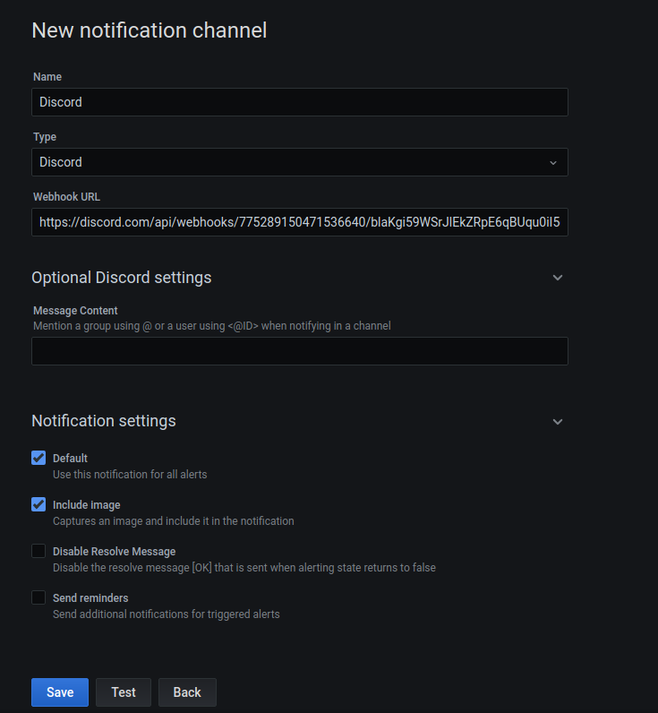
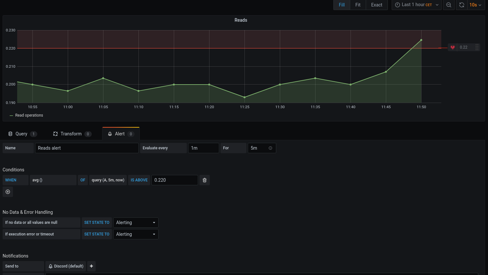
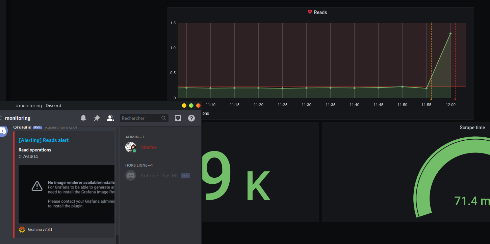

= TP10

== Docker-compose

[source,yaml]
----
include::docker-compose.yml[]
----

== Notification Channel

== Configuration d'une alerte

== Test

Ensuite après avoir faire énormément de lecture dans la BDD:

