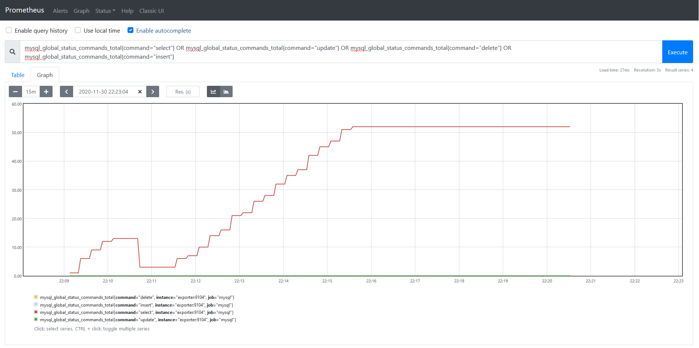
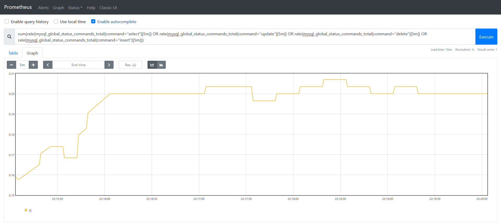

# TP8

## Partie 1

### 1 Serveur MariaDB

Extrait du docker-compose de la partie du serveur MariaDB :
```yaml
db:
    image: mariadb
    restart: on-failure
    environment:
        - MYSQL_ROOT_PASSWORD=password
    volumes:
        - ./scripts/:/docker-entrypoint-initdb.d/:ro
    networks:
        - bdd
    expose:
        - 3306
```

Script de création de l'utilisateur :
```sql
CREATE USER 'exporter'@'%' IDENTIFIED BY 'password';
GRANT PROCESS, REPLICATION CLIENT, SELECT ON *.* TO 'exporter'@'%';
```

Script de mise en place d'une DB :
```sql
DROP DATABASE IF EXISTS TP8;
CREATE DATABASE TP8;
USE TP8;

DROP TABLE IF EXISTS clients;

CREATE TABLE clients (
    nom VARCHAR(255),
    prenom VARCHAR(255),
    naissance DATE,
);

INSERT INTO clients VALUES ("Theo", "VICENTE", "2000-09-16"), ("Bob", "SINCLAR", "1969-05-10"), ("Pierre", "SALMI", "2000-12-08");

SELECT * FROM clients;
```

### 2 Serveur Prometheus

Extrait du docker-compose de la partie du serveur Prometheus :
```yaml
prometheus:
    image: prom/prometheus:latest
    container_name: prometheus
    ports:
        - 9090:9090
    networks:
        - bdd
    volumes:
        - ./config/prometheus.yml:/etc/prometheus/prometheus.yml:ro
```

Configuration du prometheus :
```yaml
global:
    scrape_interval:     15s
    evaluation_interval: 15s

alerting:
    alertmanagers:
    - scheme: http
      timeout: 10s
      static_configs:
        - targets:

scrape_configs:
    - job_name: 'prometheus'
  
      static_configs:
        - targets: ['localhost:9090']

    - job_name: 'mysql'
      static_configs:
        - targets: ['exporter:9104']
```

### 3 Serveur MySQL-Exporter

Extrait du docker-compose de la partie du serveur MySQL-Exporter :
```yaml
exporter:
    image: prom/mysqld-exporter
    container_name: mysql-exporter
    environment:
        - DATA_SOURCE_NAME=exporter:password@(db:3306)/TP8
    ports:
        - "9104:9104"
    networks:
        - bdd
    depends_on:
        - db
```

## Partie 2

### 1 Affichez les opérations de lecture et d'écriture

Avec la commande `mysql_global_status_commands_total{command="select"} OR mysql_global_status_commands_total{command="update"} OR mysql_global_status_commands_total{command="delete"} OR mysql_global_status_commands_total{command="insert"}` sur Prometheus, on obtient le graph ci-suivant :



### 2 Affichez la variation des taux d'opérations de lectures et d'écritures

Avec la commande `sum(rate(mysql_global_status_commands_total{command="select"}[5m]) OR rate(mysql_global_status_commands_total{command="update"}[5m]) OR rate(mysql_global_status_commands_total{command="delete"}[5m]) OR rate(mysql_global_status_commands_total{command="insert"}[5m]))` sur Prometheus, on obtient le graph ci-suivant :

