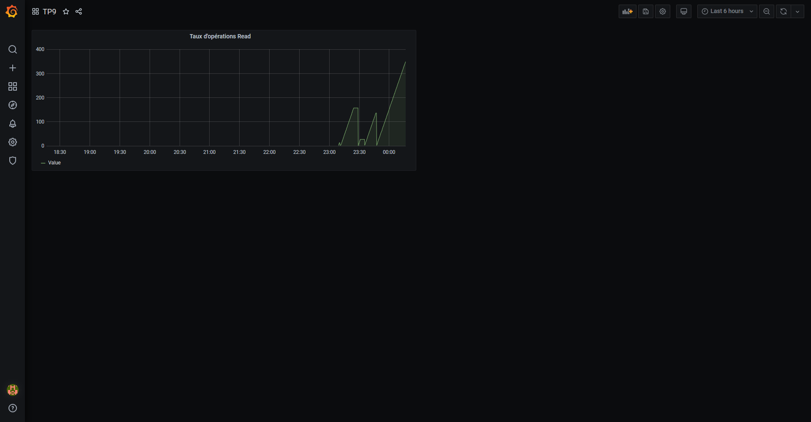

# TP9 - Dashboards avec Grafana

*Basé sur le TP8*

## Ajout d'un grafana sur le Docker-compose

> Ne pas oublier de modifier le précédent `docker-compose` en ajoutant un `expose: - 9090` sinon on ne peut pas l'ajouter en source à Grafana

Partie de grafana du Docker-compose :
```yaml
grafana:
    image: grafana/grafana
    container_name: grafana
    restart: on-failure
    volumes:
        - ./provisioning:/etc/grafana/provisioning
    environment:
        - GF_SECURITY_ADMIN_USER=admin
        - GF_SECURITY_ADMIN_PASSWORD=admin
        - GF_USERS_ALLOW_SIGN_UP="false"
    ports:
        - "3000:3000"
    networks:
        - bdd
    depends_on:
        - prometheus
        - db
```

## Ajouter la source Prometheus

Aller dans les options > Data Sources et ajouter une source avec l'adresse du serveur Prometheus

## Créez un nouveau dashboard + Ajouter taux d'opérations READ

Il suffit de click click sur l'interface de Grafana sur le "+" dans le menu à droite puis cliquer sur Dashboard, ensuite cliquer sur créer, puis cliquer sur le Add Panel.
Dans la section de création de panel, on set la formule en PromQl qu'on a utilisé juste avant : `sum(mysql_global_status_commands_total{command="select"} OR mysql_global_status_commands_total{command="update"} OR mysql_global_status_commands_total{command="delete"} OR mysql_global_status_commands_total{command="insert"})`.

------
***État du Dashboard après les deux premières parties***



------

##